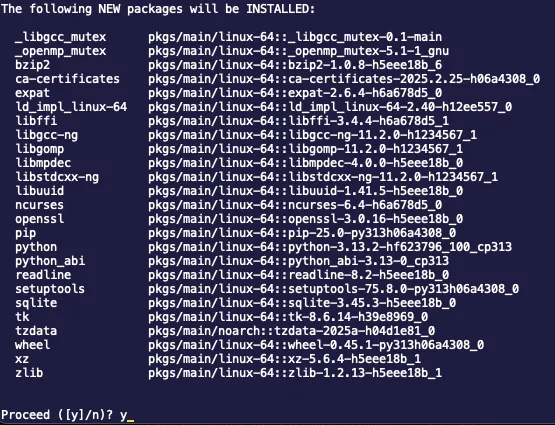
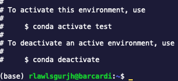
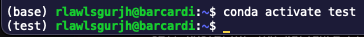
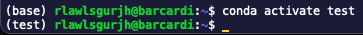
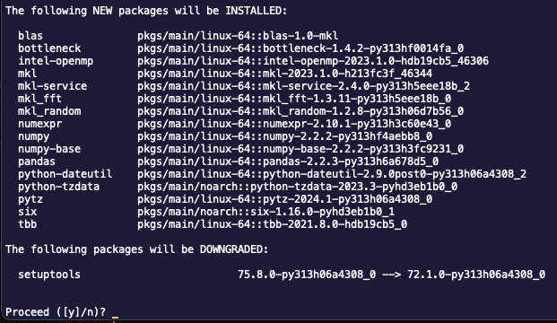
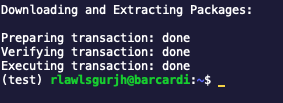
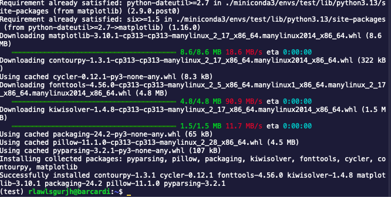

# Conda 가상환경에 라이브러리 설치

SSH 접속 환경에서 Conda 가상환경 내에서 라이브러리를 설치하는 기본적인 명령어와 사용법을 정리한 예시입니다. Conda와 pip를 활용하여 필요한 패키지들을 설치하고 관리할 수 있으며, 이를 통해 Python 개발 환경을 더욱 효율적으로 구성할 수 있습니다.

## Prerequisite

- [Ubuntu에서 Miniconda 설치](https://jjjabcd.github.io/github-pages/linux/2025/03/18/linux-conda.html)

## Conda 가상환경에서 라이브러리 설치란?

Conda 가상환경은 프로젝트별로 독립적인 패키지와 Python 버전을 관리할 수 있게 해줍니다. 이를 통해 서로 다른 프로젝트 간의 패키지 충돌 없이 안정적인 개발 환경을 유지할 수 있습니다.

### 새로운 Conda 환경 생성

```bash
conda create -n myenv python=3.9
```

위 명령어를 실행하면 다음과 비슷한 화면이 나온다.

<figure style="text-align: center;">
  
  <!-- # alt="fig1" style="max-width: 100%;">
  <figcaption>Figure 1. Conda environment activation</figcaption> -->
</figure>

설치되는 패키지들을 확인하고, y를 누르면 설치가 완료된다.

<figure style="text-align: center;">
  
  <!-- # alt="fig1" style="max-width: 100%;">
  <figcaption>Figure 1. Conda environment activation</figcaption> -->
</figure>

설치가 완료되면 다음과 같은 안내 문구가 뜨게 된다.

y를 누르지 않아도 되는 상황에선 다음과 `-y`옵션을 사용해 바로 설치 되게 할 수 있다.

```bash
conda create -n test python -y
```

`-n` 옵션은 name의 약자로 가상환경의 이름으로 사용할 이름을 입력할 수 있음

### 생성한 환경 활성화

```bash
conda activate test
```

활성화 한 후, (base)가 (test) 혹은 가상환경 이름으로 바뀌었는지 꼭 확인해야됩니다.

<figure style="text-align: center;">
  
  <!-- # alt="fig1" style="max-width: 100%;">
  <figcaption>Figure 1. Conda environment activation</figcaption> -->
</figure>

**주의사항**

- `(base)`가 아닌 `conda activate {가상환경 이름}` 을 통해 가상환경을 활성화 시켜야합니다.

<figure style="text-align: center;">
  
  <!-- # alt="fig1" style="max-width: 100%;">
  <figcaption>Figure 1. Conda environment activation</figcaption> -->
</figure>

<figure style="text-align: center;">
  
  <!-- # alt="fig1" style="max-width: 100%;">
  <figcaption>Figure 1. Conda environment activation</figcaption> -->
</figure>

## Conda 기본 라이브러리 설치 명령어

conda에서는 기본적으로 아래와 같이 패키지를 설치할 수 있습니다.

### 기본 설치

- 명령어

```bash
conda install {패키지 명}
```

- 사용 예시

```bash
conda install pandas
```

위 명령어를 통해 conda의 기본 채널에서 pandas 패키지를 설치한다.

<figure style="text-align: center;">
  
  <!-- # alt="fig1" style="max-width: 100%;">
  <figcaption>Figure 1. Conda environment activation</figcaption> -->
</figure>

<figure style="text-align: center;">
  
  <!-- # alt="fig1" style="max-width: 100%;">
  <figcaption>Figure 1. Conda environment activation</figcaption> -->
</figure>

y를 입력하면 된다.

<figure style="text-align: center;">
  
  <!-- # alt="fig1" style="max-width: 100%;">
  <figcaption>Figure 1. Conda environment activation</figcaption> -->
</figure>

이런 화면이 뜨면 설치가 완료된 것이다.

conda install pandas를 할 때 `-y` 옵션을 뒤에 작성해주면 이 과정 없이 설치가 완료된다.

### 특정 채널을 지정하여 설치

그냥 `conda install`을 하게 된다면 기본 채널에서 패키지를 설치하게 되는데, 기본 채널에 패키지가 없는 경우 혹은 특정 채널의 패키지가 필요할 때 사용하는 옵션입니다. `-c` 옵션을 사용하여 채널을 명시할 수 있습니다.

- conda-forge 채널 사용 명령어

```bash
conda install -c conda-forge {패키지명}
```

- conda-forge 채널 사용 예시

```bash
conda install -c conda-forge pandas
```

- pytorch 채널 사용 예시

```bash
conda install -c pytorch pytorch torchvision
```

PyTorch 및 관련 패키지들은 pytorch 채널을 통해 설치하는 것이 권장됨

## pip를 이용한 라이브러리 설치

가상환경 내에서 pip를 사용하면 Conda에 없는 패키지를 설치할 수 있습니다.

- **주의사항**
- Conda 환경에서는 가급적 Conda 패키지로 설치할 수 있는 라이브러리를 우선적으로 사용하는 것이 좋습니다. pip와 Conda를 혼용할 경우 패키지 충돌이 발생할 수 있으므로, pip를 사용할 때는 설치 후 dependencies를 확인하는 것이 필요합니다.
- 그래서 가급적 Conda의 기본채널이나 Conda-forge의 채널에서 설치하는 것을 권장합니다.

pip는 conda와 동일한 명령어로 설치가 가능하다.

```bash
pip install matplotlib
```

<figure style="text-align: center;">
  
  <!-- # alt="fig1" style="max-width: 100%;">
  <figcaption>Figure 1. Conda environment activation</figcaption> -->
</figure>

pip는 conda install과 다르게 따로 Proceed ([y], n)?가 뜨지않고 바로 설치된다.

<figure style="text-align: center;">
  
  <!-- # alt="fig1" style="max-width: 100%;">
  <figcaption>Figure 1. Conda environment activation</figcaption> -->
</figure>

이런 화면이 뜬다면 설치가 완료된 것이다.

예시로 만든 가상환경이기에 Conda와 pip를 신경쓰지 않고 설치했지만 주의사항이 있어 [다음 글](https://jjjabcd.github.io/github-pages/linux/2025/03/20/linux-environment.html)을 참고하면 된다.

## Conda와 pip 설치 시의 개념 및 사용법 정리

Conda 설치:

Conda는 패키지 관리 및 환경 관리를 동시에 지원하며, 라이브러리들을 손쉽게 설치할 수 있습니다.

pip 설치:

pip는 Python의 표준 패키지 관리 도구로, PyPI(Python Package Index)에서 라이브러리를 설치할 수 있습니다.

채널:

Conda 패키지는 여러 채널을 통해 관리되며, `-c` 옵션을 사용하며 특정 채널에서 설치할 수 있습니다. 예를 들어, conda-forge나 pytorch와 같이 신뢰할 수 있는 채널을 지정하여 설치하면 최신 패키지를 보다 안정적으로 설치할 수 있습니다.

밑에 링크를 통해 지원하는 패키지가 있는지의 유무와 패키지의 이름이나 버전 등을 파악할 수 있습니다.

- [conda-forge | Anaconda.org](https://anaconda.org/conda-forge)
- [PyPI · The Python Package Index](https://pypi.org/)

### [참고자료]

- [[파이썬, python] 아나콘다 가상환경 생성, 복사, 라이브러리 설치](https://alliswellv2030.tistory.com/3)

- [[Anaconda] 가상환경 확인/생성/활성화/설치/패키지 확인/패키지 파일 추출/비활성화/삭제](https://mingyu6952.tistory.com/entry/Anaconda-%EA%B0%80%EC%83%81%ED%99%98%EA%B2%BD-%ED%99%95%EC%9D%B8%EC%83%9D%EC%84%B1%ED%99%9C%EC%84%B1%ED%99%94%EC%84%A4%EC%B9%98%ED%8C%A8%ED%82%A4%EC%A7%80-%ED%99%95%EC%9D%B8%EB%B9%84%ED%99%9C%EC%84%B1%ED%99%94%EC%82%AD%EC%A0%9C)
