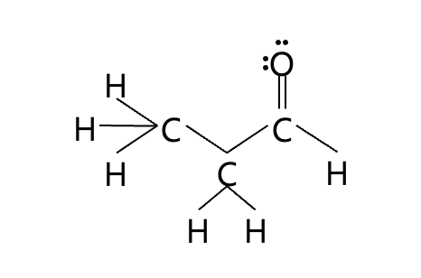
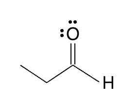
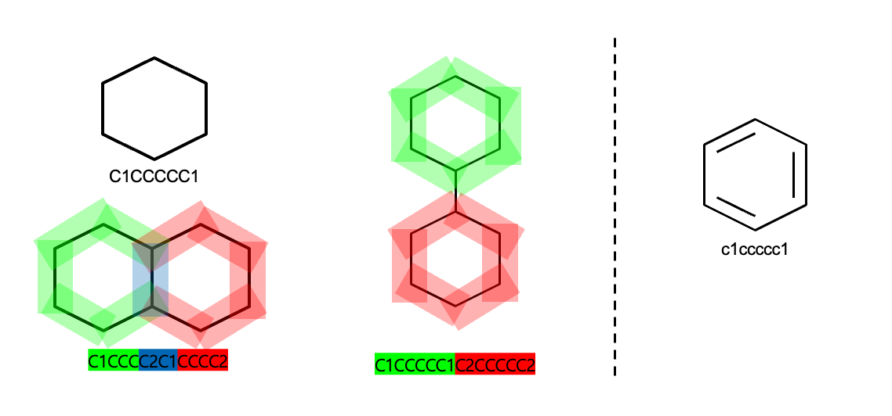
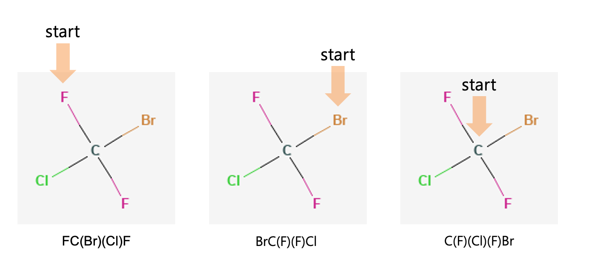
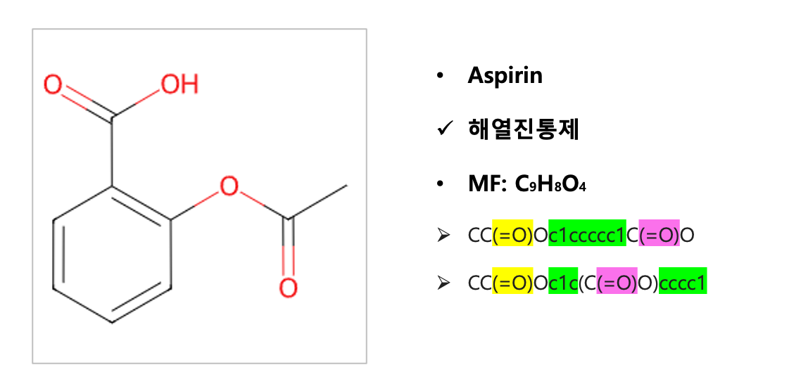
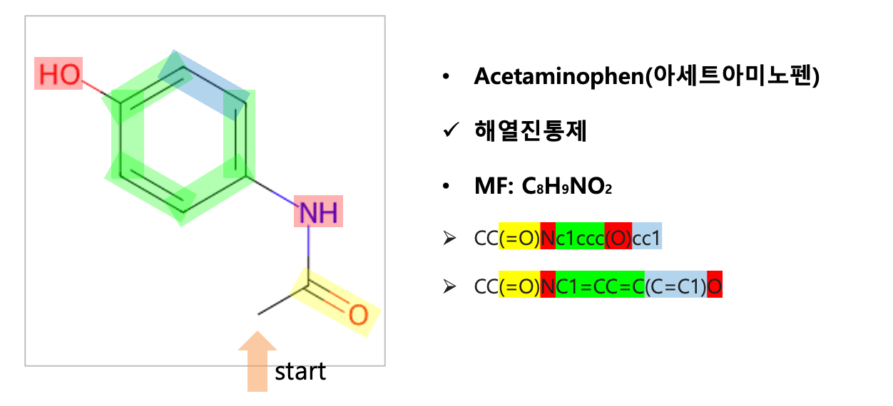

한두 줄 테스트 내용입니다.

## 분자구조 표기법 소개

화학 분자를 표현하는 방법은 크게 사람이 읽기 쉬운(Human-readable) 방식과 컴퓨터가 읽기 쉬운(Computer-readable) 방식으로 나눌 수 있다.

- 사람이 읽기 쉬운 방식 (Human-readable)
  - Condensed Formula (축약 구조식)
  - Kekulé Diagram (Lewis Structure를 기반으로 한 Bond 표기)
  - Bond-Line Formula (zig-zag 형태의 골격 구조)

- 컴퓨터가 읽기 쉬운 방식 (Computer-readable)
  - SMILES (Simplified Molecular Input Line Entry System)
  - IUPAC (International Union of Pure and Applied Chemistry)
  - InChI (International Chemical Identifier)
  - SELFIES (Self-Referencing Embedded Strings)
  - SMARTS

이 중 SMILES는 문자열 기반으로 분자 구조를 표현하는 대표적인 포맷으로, 간단한 텍스트로 화합물을 직관적으로 기술할 수 있다는 장점이 있다.

---

## 사람이 읽기 쉬운 방식 (Human-readable) 예

### Name

- Propanal

### Kekulé

### Condensed Formula

- $CH_3CH_2CHO$

### Bond-line

## 컴퓨터에서 사용하는 방식 (Computer-readable) 예

- SMILES(Simplified Molecular Input Line Entropy System)

## SMILES

SMILES는 분자구조를 string으로 표현하는 표기법, 분자 구조의 **,atom, bond, ring, aromaticity, branch** 등을 특정 규칙에 따라 문자열로 변환합니다. 특정 시작 atom을 정하고, 분자구조를 DFS 알고리즘을 통해 SMILES string으로 반환한다.

### SMILES 표기법의 장점

1. **간결함**: 한 줄의 문자열로 복잡한 분자 구조를 표현 가능
2. **기계 처리 용이**: 문자열이므로 DB에 저장하거나 프로그램으로 파싱하기 쉬움
3. **가독성**: 간단한 규칙만 익히면 사람이 읽고 쓰기도 비교적 쉬움
4. 문자열 형태로 표현되기 때문에, 머신러닝/딥러닝에서 NLP에서 활용되는 다양한 알고리즘을 사용할 수 있음

### SMILES 표기법의 단점

1. 문자열 자체로 기존 NLP에서 사용하는 유사도, BLUE 그리고 ROUGE 같은 지표를 사용할 수 없음
2. 서로 분자구조가 비슷하더라도 SMILES string 자체는 매우 달라보일 수 있음
3. 시작 atom 또는 읽는 방향에 따라 같은 분자구조여도 SMILES string은 다양하게 나올 수 있음

| Name        | Descriptions                                                                                                                | Examples                                                                               |
| ----------- | --------------------------------------------------------------------------------------------------------------------------- | -------------------------------------------------------------------------------------- |
| Atoms       | 화학 원소의 표준 약어로 표현 전하 및 수소를 보여주기 위해 대괄호 사용                                                    | B, C, N, O, F, P, S, Cl, Br, I [Au], [Ag], [Cu] [Cl-], [OH-], [NH4+]             |
| Bonds       | 단일 결합: `-` 이중, 삼중, 사중 결합: `=`, `#`, `$` 결합되지 않은 표현: `.`                                           | CCC O=C=O C#N [Ga+]$[As-] [Na+].[Cl-]                                      |
| Rings       | 고리 결합 표현: 두 개의 일치하는 정수 라벨 사용 고리 숫자는 순서대로 사용할 필요 없음 고리 닫힘 이후 숫자 재사용 가능 | C1CCCCC1 C1CCCC2C1CCCC2 C1CCCCC1C2CCCCC2 C1CCCCC1C1CCCCC1 C1=CC1 C=1CC1 |
| Aromaticity | 방향족 고리 표현 `:` 사용 또는 소문자 원자 사용                                                                          | C1=CC=CC=C1 C:1:C:C:C:C:C1 c1ccccc1                                              |
| Branching   | 괄호를 사용하여 가지 구조 표현 작성 순서는 자유로움                                                                      | CCC(=O)O FC(Br)(Cl)F BrC(F)(F)Cl C(F)(Cl)(F)Br                                |

## SMILES example

### Ring & Aromaticity

### Branch

### Excercise (1/2)

### Exercise (2/2)

### [참고자료]

---

[SMILES표기법이란? (SMILES representation 설명 및 장단점)](https://process-mining.tistory.com/158)

Weininger, D. (1988). SMILES, a chemical language and information system. 1. Introduction to methodology and encoding rules. *Journal of chemical information and computer sciences*, *28*(1), 31-36.
